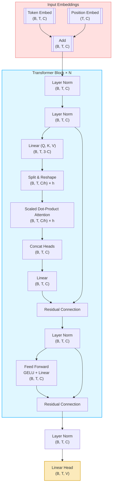
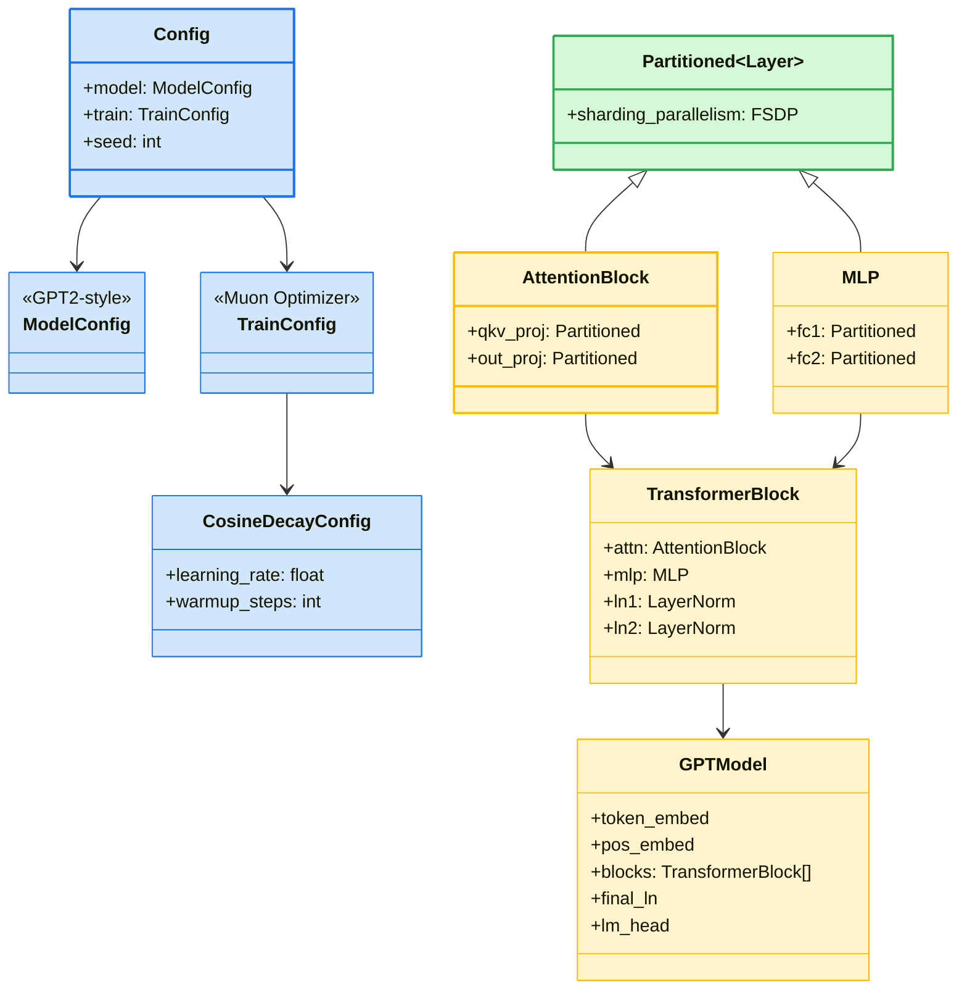

# jNanoGPT

This repository aims at replicating [modded-nangpt](https://github.com/KellerJordan/modded-nanogpt) training with Jax instead of Pytorch. I would call it a speedrun for j-training. 

The aim is to search for the fastest algorithm to use 8 NVIDIA H100 GPUs to train a language model that attains 3.28 cross-entropy loss on the [FineWeb](https://huggingface.co/datasets/HuggingFaceFW/fineweb) validation set.

The target (3.28 validation loss on FineWeb) follows Andrej Karpathy's [GPT-2 replication in llm.c, which attains that loss after running for 45 minutes](https://github.com/karpathy/llm.c/discussions/481#:~:text=By%20the%20end%20of%20the%20optimization%20we%27ll%20get%20to%20about%203.29).
The speedrun code also descends from llm.c's [PyTorch trainer](https://github.com/karpathy/llm.c/blob/master/train_gpt2.py), which itself descends from NanoGPT, hence the name of the repo.

Key performance improvements to add:
* Modernized architecture: Rotary embeddings, QK-Norm, and ReLU²
* The Muon optimizer [[writeup](https://kellerjordan.github.io/posts/muon/)] [[repo](https://github.com/KellerJordan/Muon)]
* Untie head from embedding, use FP8 matmul for head, and softcap logits (the latter following Gemma 2)
* Initialization of projection and classification layers to zero (muP-like)

**TODO**

- [x] `basics` folder with relevant transformers implementations.
- [ ] include basics on data, pipeline and tensor parallelism. 
- [x] JAX version of `ref/train_gpt.py` using FSDP. 
- [ ] Profiling. Ensure proper resource utilization, optimizing `batch_size, num_microbatches` and hyperparameter tunning. 

## Overview

`train_jgpt_fsdp.py` implements a GPT-2-style transformer in JAX/Flax, with Fully-Sharded Data Parallelism (FSDP). The idea came from the lecture notes (FSDP+JAX)[https://uvadlc-notebooks.readthedocs.io/en/latest/tutorial_notebooks/scaling/JAX/data_parallel_fsdp.html].

In the file, several things are done. Here is a brief overview:

* ModelConfig: sizes for embeddings, layers, dropout, rematerialization

* CosineDecayConfig & TrainConfig: learning-rate schedule (warm-up + cosine decay), optimizer hyperparameters.

* `create_named_sharding(mesh, axes)`: builds a NamedSharding for a given device mesh and axis names.

* `shard_module_params`: wraps `flax.linen.Module`'s, partitioning the weights along a specified axis.

>[!IMPORTANT]
> Refer to the fantastic lecture notes (**Training Models at Scale**)[https://uvadlc-notebooks.readthedocs.io/en/latest/tutorial_notebooks/scaling/JAX/overview.html] for more details, as I've taken some function definitions from there. 

## Model overview
The model implemented here is a GPT2-style model, i.e. a mix of Embedding layer -> transformer blocks -> Tie-Embedding.
All of it can be trained and tested in Kaggle resources, which is the initial goal. I would love to test it on H100 or H200 (It's in TODO). 

To understand the diagram below, I use the following: 
* (B, T, C) — Batch × Sequence × Embedding dim
* N = Number of transformer blocks
* h = Number of attention heads

## Modules overview

The overall module structure can be found below.

