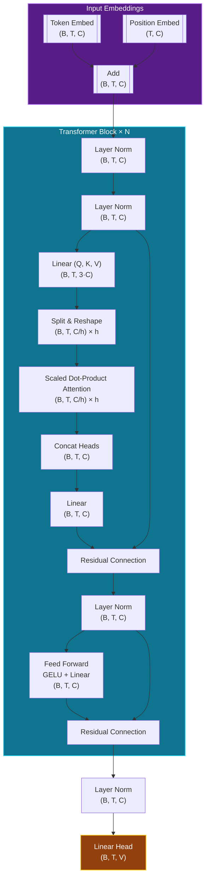

# jNanoGPT

This repository aims at replicating [modded-nangpt](https://github.com/KellerJordan/modded-nanogpt) pre-training with Jax instead of Pytorch. *I would call it a speedrun for j-training*. 

The aim is to search for the fastest algorithm to use 8 NVIDIA H100 GPUs to train a language model that attains 3.28 cross-entropy loss on the [FineWeb](https://huggingface.co/datasets/HuggingFaceFW/fineweb) validation set.

The target (3.28 validation loss on FineWeb) follows Andrej Karpathy's [GPT-2 replication in llm.c, which attains that loss after running for 45 minutes](https://github.com/karpathy/llm.c/discussions/481#:~:text=By%20the%20end%20of%20the%20optimization%20we%27ll%20get%20to%20about%203.29).
The speedrun code also descends from llm.c's [PyTorch trainer](https://github.com/karpathy/llm.c/blob/master/train_gpt2.py), which itself descends from NanoGPT, hence the name of the repo.

Key performance improvements to add:
* Modernized architecture: Rotary embeddings, QK-Norm, and ReLU²
* The Muon optimizer [[writeup](https://kellerjordan.github.io/posts/muon/)] [[repo](https://github.com/KellerJordan/Muon)]
* Untie head from embedding, use FP8 matmul for head, and softcap logits (the latter following Gemma 2)
* Initialization of projection and classification layers to zero (muP-like)


Check the current results here: 

[ jGPT2-style Partial Sharding-DP](https://www.kaggle.com/code/reidmen/jgpt2) pre-trained fully on v3-8 TPU instances, on 25K steps (~1hr) with sharded parameters for all layers, except the embeddings. 

[ jGPT2-style FSDP](https://www.kaggle.com/code/reidmen/jgpt2-fully-sharded) also pre-trained on v3-8 TPU instances, on 45K (~1hr) with full sharding (FSDP). 


## Loss/Accuracy Logs FSDP
Current pretraining reaches `5.25` in ~50K. This can be done better! Check the [accuracy/loss curves here](https://github.com/Reidmen/jnanogpt/tree/main/images/loss_accuracy_45k.png). 
```
...
4068.7s	731	[2025-08-02 20:12:38.714136] Iteration 49400
4068.7s	732	{'accuracy': Array(15.780784, dtype=float32), 'loss': Array(5.3125, dtype=bfloat16)}
4083.1s	733	[2025-08-02 20:12:53.125201] Iteration 49600
4083.2s	734	{'accuracy': Array(15.798374, dtype=float32), 'loss': Array(5.28125, dtype=bfloat16)}
4098.8s	735	[2025-08-02 20:13:08.822760] Iteration 49800
4098.9s	736	{'accuracy': Array(15.815722, dtype=float32), 'loss': Array(5.25, dtype=bfloat16)}
4113.5s	737	[2025-08-02 20:13:23.474305] Iteration 50000
4113.5s	738	{'accuracy': Array(15.832816, dtype=float32), 'loss': Array(5.25, dtype=bfloat16)}
4122.0s	739	FSDP - Final metrics
4122.0s	740	{'accuracy': Array(15.832816, dtype=float32), 'loss': Array(5.25, dtype=bfloat16)}
```

---

**TODO**

- [x] `basics` folder with relevant transformers implementations.
- [x] include notebook on data parallelism. 
- [x] JAX version of `ref/train_gpt.py` using FSDP. 
- [ ] pretraining to reach loss `< 3.2`. Currently FSDP loss at `5.45` using 45K steps.
- [ ] Profiling. Ensure good resource utilization, optimizing `batch_size, num_microbatches` and hyperparameter tunning. 
- [ ] extend to pipeline and tensor parallelism. 
- [ ] H100 / H200 version + scaling.


## Overview

`train_jgpt_fsdp.py` implements a GPT-2-style transformer in JAX/Flax, with Fully-Sharded Data Parallelism (FSDP). The idea came from the lecture notes [FSDP+JAX](https://uvadlc-notebooks.readthedocs.io/en/latest/tutorial_notebooks/scaling/JAX/data_parallel_fsdp.html).

In the file, several things are done. Here is a brief overview:

* ModelConfig: sizes for embeddings, layers, dropout, rematerialization

* CosineDecayConfig & TrainConfig: learning-rate schedule (warm-up + cosine decay), optimizer hyperparameters.

* `create_named_sharding(mesh, axes)`: builds a NamedSharding for a given device mesh and axis names.

* `shard_module_params`: wraps `flax.linen.Module`'s, partitioning the weights along a specified axis.

>[!IMPORTANT]
> Refer to the fantastic lecture notes [**Training Models at Scale**](https://uvadlc-notebooks.readthedocs.io/en/latest/tutorial_notebooks/scaling/JAX/overview.html) for more details, as I've taken some function definitions from there. 

>[!NOTE]
> Looking for collaborations to optimize the code, target `<1000 LOC` that is fast and run in v4, v5 TPU and H100 instances.

## Model overview
The model implemented here is a GPT2-style model, i.e. a mix of `Embedding layer -> Transformer Blocks + MLP -> Tie-Embedding`.
Total parameter count is slightly over `2M`, for a model with 12 layers, embedding and hidden size of 1024, and 50257 for the vocab size (as the GPT2).

> All of it can be trained and tested in Kaggle resources. 
> The goal is to compare v5-TPU vs. H100 or H200 (It's in TODO). 

To understand the diagram below, I use the following notation: 
* (B, T, C) — Batch × Sequence × Embedding dim
* N = Number of transformer blocks
* h = Number of attention heads

Further details can be seen in the Kaggle links.




## Modules overview

The overall module structure can be found below.

